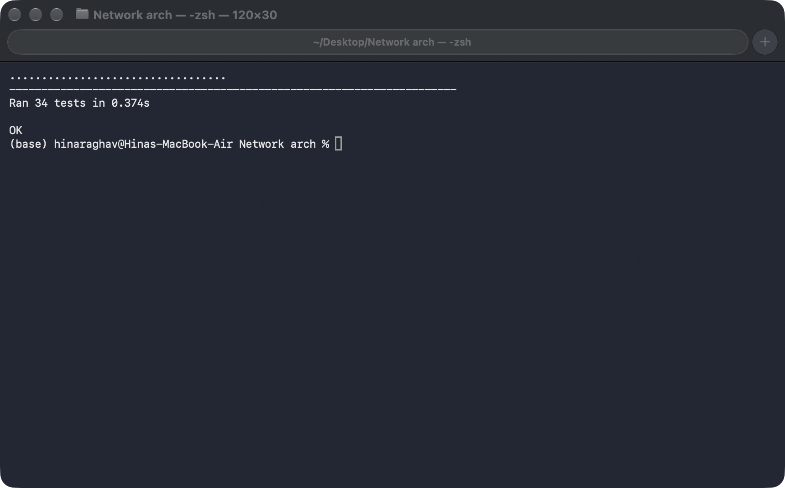
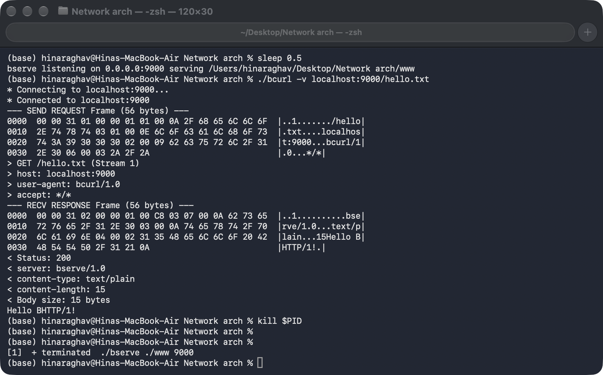
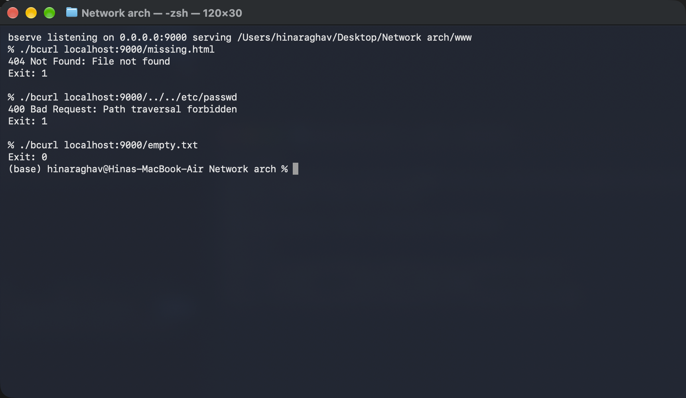

# BHTTP/1 — Binary HTTP Protocol & Dual-Track Networking System

An end-to-end, zero-dependency, binary-framed HTTP protocol engineering project designed and implemented from first principles. Built to strictly satisfy the requirements of the **Course Project: HTTP, in Binary — Two Tracks, One Protocol**.

---

## Visual Verification (Terminal Captures)

Live terminal execution captures on macOS:

### 1. Complete Automated Test Suite

*Figure 1: Test suite executing across protocol unit tests, stream fragmentation/coalescing tests, unknown-frame skipping, path traversal attacks, and persistent connection reuse.*

### 2. Client Wire Trace (`./bcurl -v` Hexdump)

*Figure 2: Standalone `./bserve` background process serving `/hello.txt` to `./bcurl -v` with annotated 56-byte request/response hex traces, static HPACK headers, and exit code 0.*

### 3. Error Handling, Exit Codes & Directory Traversal Security

*Figure 3: Client asserting exit code 1 on 404 Not Found (`/missing.html`), defending against directory traversal attacks (`/../../etc/passwd` returning 400 Bad Request, exit code 1), and serving empty files (`/empty.txt`, exit code 0).*

---

## 1. Course Project Context & Core Philosophy

The project mandate establishes a core conceptual requirement:

> *"In pairs: one server, one client, and the only thing that crosses between you is the spec. A client that only works against your own server is an implementation, not a protocol."*

A protocol is not merely code; it is a contract. If two engineers write a client and a server independently in different languages without ever seeing each other's source code, both programs must interoperate without error if and only if both adhere to [`SPEC.md`](SPEC.md).

```
                      +-----------------------------+
                      |           SPEC.md           |
                      |  (Independent Specification) |
                      +--------------+--------------+
                                     |
                      +--------------v--------------+
                      |         protocol.py         |
                      |   - 7-Byte Fixed Header     |
                      |   - Exact TCP I/O Framing   |
                      |   - HPACK Static Headers    |
                      |   - Frame Encode / Decode   |
                      +-------+-------------+-------+
                              |             |
                 +------------v----+   +----v------------+
                 |     bserve      |   |      bcurl      |
                 |  (server.py)    |   |   (client.py)   |
                 | - Traversal Def |   | - Single Socket |
                 | - Persistent    |   | - Hexdump Trace |
                 | - Skip Unknown  |   | - Standard Exit |
                 +--------+--------+   +--------+--------+
                          |                     |
                          +<======== TCP =======>+
```

---

## 2. Repository Architecture & File Mapping

```
Network_Arch_Project/
├── SPEC.md                  # Formal 2-page equivalent protocol specification
├── README.md                # Comprehensive project documentation & architecture
├── HEXDUMP.md               # Byte-by-byte annotated dump of live TCP exchange
├── protocol.py              # Shared binary framing, header table, and exact I/O
├── server.py                # Track 1 binary server implementation
├── client.py                # Track 2 binary client implementation
├── bserve                   # Executable server script (chmod +x)
├── bcurl                    # Executable client script (chmod +x)
├── docs/
│   └── images/              # Terminal execution captures
│       ├── test_suite_run.png
│       ├── bcurl_verbose_trace.png
│       └── bcurl_error_exit_codes.png
├── tests/                   # Automated test matrix
│   ├── __init__.py
│   ├── test_protocol.py     # Protocol unit tests (encoding, decoding, limits)
│   ├── test_framing.py      # TCP fragmentation, coalescing, zero-length
│   ├── test_unknown_frame.py# Forward compatibility frame skipping
│   └── test_e2e.py          # End-to-end server, client, traversal, persistence
└── www/                     # Web root fixtures
    ├── index.html           # Sample HTML document
    ├── hello.txt            # Plain text greeting
    ├── empty.txt            # 0-byte edge-case file
    └── test.bin             # 16 KiB pseudo-random binary asset
```

---

## 3. The BHTTP/1 Protocol Wire Specification

### 3.1 The Invariant 7-Byte Fixed Frame Header

Every BHTTP/1 frame transmitted over TCP begins with an immutable 7-byte binary header:

```
  0                   1                   2                   3
  0 1 2 3 4 5 6 7 8 9 0 1 2 3 4 5 6 7 8 9 0 1 2 3 4 5 6 7 8 9 0 1
 +-----------------------------------------------+---------------+
 |                Payload Length (24)            |Frame Type (8) |
 +---------------+-------------------------------+---------------+
 |   Flags (8)   |                Stream ID (16)                 |
 +---------------+-----------------------------------------------+
```

| Byte Offset | Field Name | Width | Type | Description |
| :---: | :--- | :---: | :---: | :--- |
| `00..02` | **Payload Length** | 3 Bytes (24 bits) | Big-Endian uint | Exact payload size in bytes (0 to 16,777,215 bytes). Excludes the 7-byte header. |
| `03` | **Frame Type** | 1 Byte (8 bits) | uint8 | Identifies frame purpose (`0x01` REQUEST, `0x02` RESPONSE). |
| `04` | **Flags** | 1 Byte (8 bits) | bitfield | Bit 0 (`0x01`): `END_STREAM`. Bits 1..7: Reserved (MUST be 0). |
| `05..06` | **Stream ID** | 2 Bytes (16 bits) | Big-Endian uint | Transaction correlation tag (1 to 65,535). |

### 3.2 Defense of Field Widths (Comparison with HTTP/2)

The assignment slide explicitly asks: **"HTTP/2 chose 24 / 8 / 8 / 31. Why? Defend your widths."**

#### The RFC 7540 (HTTP/2) Reality:
1. **24-bit Length Prefix (`2^24 - 1` = 16,777,215 bytes):**
   In HTTP/2, the default maximum frame payload size is 2^14 bytes (16,384 bytes). Endpoints can negotiate larger frames up to 2^24 - 1 bytes via the `SETTINGS_MAX_FRAME_SIZE` setting. A 24-bit limit balances high throughput for large file transfers against the memory buffer allocation required by intermediaries.
2. **8-bit Type:**
   Supports up to 256 frame types (RFC 7540 defines 10 core types), leaving substantial room for protocol extensions.
3. **8-bit Flags:**
   Provides 8 independent boolean flags per frame type (e.g., `END_STREAM`, `END_HEADERS`, `PADDED`, `ACK`).
4. **31-bit Stream ID (Leaves 1 bit reserved; IDs are never reused):**
   HTTP/2 reserves the highest bit (bit 31), leaving a 31-bit unsigned integer (up to 2,147,483,647 streams). Crucially, **stream IDs in HTTP/2 are strictly monotonic and never reused** on a connection. Once a stream closes, its ID is exhausted. Client-initiated streams take odd numbers and server-initiated streams take even numbers. A 31-bit space ensures a long-lived multiplexed TCP connection can handle hundreds of millions of concurrent or sequential streams before exhausting IDs and requiring a `GOAWAY` frame.

#### BHTTP/1 Engineering Defense (7 Bytes: 24 / 8 / 8 / 16):
- **Why 7 bytes instead of 9 bytes?**
  Eliminating 2 bytes from every frame reduces per-frame header overhead by 22.2% (7 bytes vs 9 bytes). For lightweight binary protocols transferring many small resources, this minimizes bandwidth waste.
- **Why 24-bit Length (16 MiB max)?**
  A 24-bit payload length allows BHTTP/1 to transfer typical static web assets (HTML, CSS, JS, images up to 16 MiB) in a single unfragmented `RESPONSE` frame. This eliminates the need for multi-frame chunk reassembly or `CONTINUATION` frames, keeping client and server implementations clean and robust while enforcing a strict safety ceiling against memory exhaustion.
- **Why 16-bit Stream ID (65,535)?**
  Unlike HTTP/2, BHTTP/1 does not support concurrent asynchronous tree multiplexing with dependency weighting. Requests and responses are processed sequentially over persistent TCP connections. Stream IDs serve to correlate request and response pairs. A 16-bit unsigned integer supports 65,535 sequential request-response cycles on a single TCP connection before rolling over, which exceeds the lifecycle needs of typical persistent HTTP sessions while keeping the frame header compact.

### 3.3 Frame Types & Registry

| Type Byte | Name | Direction | Description |
| :---: | :--- | :---: | :--- |
| `0x01` | **REQUEST** | Client -> Server | Initiates an HTTP-like resource request. |
| `0x02` | **RESPONSE** | Server -> Client | Delivers status, headers, and body bytes. |
| `0x03`..`0xFE` | **RESERVED / EXTENSION** | Bidirectional | Reserved for version-2 forward extensions (PING, METADATA). |
| `0xFF` | **RESERVED** | N/A | Reserved for experimental testing. |

### 3.4 Compact Header Encoding (Inspired by HPACK Concepts)

To avoid redundant string transmission, BHTTP/1 uses compact header encoding inspired by HPACK concepts: a predefined 10-entry static name table and length-prefixed literals (without dynamic tables or Huffman coding).

#### Static Name Table (IDs 1 through 10)
```
1: host           3: content-type      5: connection    7: server    9: last-modified
2: user-agent     4: content-length    6: accept        8: date     10: etag
```

#### Binary Layouts
- **Case A — Predefined Indexed Header (`1 <= ID <= 10`):**
  ```
  +---------------+-------------------------------+-----------------------+
  |  Name ID (8)  |       Value Length (16)       |  Value Bytes (UTF-8)  |
  +---------------+-------------------------------+-----------------------+
  ```
- **Case B — Literal Custom Header (`ID == 0x00`):**
  ```
  +---------------+---------------+-----------------------+-------------------------------+-----------------------+
  |  Name ID (8)  |Name Length (8)|  Name Bytes (UTF-8)   |       Value Length (16)       |  Value Bytes (UTF-8)  |
  |    (0x00)     |  (1..255)     |      (Variable)       |          Big-Endian           |     (Variable)        |
  +---------------+---------------+-----------------------+-------------------------------+-----------------------+
  ```

### 3.5 Request Frame Payload Layout (`Type = 0x01`)

```
+---------------+-------------------------------+-----------------------+
|  Method (8)   |       Path Length (16)        |   Path Bytes (UTF-8)  |
+---------------+-------------------------------+-----------------------+
| Hdr Count (8) | Header Entries (0 or more, encoded per Section 3.4) ...|
+---------------+-------------------------------------------------------+
```
- **Method (1 byte):** `0x01` = GET, `0x02` = HEAD, `0x03` = POST.
- **Path Length (2 bytes, Big-Endian):** 1 to 4096 bytes.
- **Path Bytes (UTF-8):** Normalized path (e.g., `/hello.txt`). Must start with `/` and contain no NUL bytes.
- **Header Count (1 byte):** Number of header entries following.

### 3.6 Response Frame Payload Layout (`Type = 0x02`)

```
+-------------------------------+---------------+-------------------------------------------------------+
|        Status Code (16)       | Hdr Count (8) | Header Entries (0 or more, encoded per Section 3.4) ...|
+-------------------------------+---------------+-------------------------------------------------------+
| Body Bytes (Raw Binary, Length = Payload Length - Offset of Body) ...                                 |
+-------------------------------------------------------------------------------------------------------+
```
- **Status Code (2 bytes, Big-Endian):** Numeric status (200, 400, 404, 500).
- **Header Count (1 byte):** Number of header entries following.
- **Body Bytes:** All remaining payload bytes. Body length is strictly derived:
  ```text
  Body Length = Payload Length - (Size of Status + Size of Hdr Count + Total Headers Size)
  ```
- Bodies are raw binary data (supporting PNGs, binaries, HTML, or empty 0-byte files) and are **never NUL-terminated**.

---

## 4. The Mandatory Unknown-Frame Forward Compatibility Rule

The assignment explicitly specifies:

> *"And one line you may not skip: a receiver meeting a frame type it does not know MUST skip it cleanly. That is how you leave room for a version 2."*

If a version 1 server encounters a version 2 frame (such as `0x42` `METADATA` or `0x77` `PING`), it must not crash, close the TCP connection, or corrupt its parser state.

### The Receiver State Machine
1. Receiver reads exactly 7 bytes to decode the header.
2. It parses `Payload Length`.
3. If `Frame Type` is unrecognized (`0x03`..`0xFE`):
   - It reads exactly `Payload Length` bytes from TCP using `read_exact()`.
   - It silently discards the payload.
   - It resumes reading the next 7-byte header immediately from the socket.

---

## 5. TCP Stream Framing & Exact Network I/O Engine

TCP is a stream-oriented protocol with no concept of frame boundaries. A single `recv(4096)` call might return 2 bytes of a header, half a payload, or multiple frames coalesced together.

Both `bserve` and `bcurl` communicate exclusively through the exact I/O primitives implemented in [`protocol.py`](protocol.py):

```python
def read_exact(sock: socket.socket, num_bytes: int) -> bytes:
    chunks = []
    bytes_read = 0
    while bytes_read < num_bytes:
        chunk = sock.recv(min(num_bytes - bytes_read, 65536))
        if not chunk:
            if bytes_read == 0:
                raise ConnectionClosedError("Clean EOF at frame boundary")
            raise TruncatedFrameError("Connection dropped mid-frame")
        chunks.append(chunk)
        bytes_read += len(chunk)
    return b"".join(chunks)
```

This guarantees that:
1. Headers are always reconstructed from exactly 7 bytes regardless of packet fragmentation.
2. Payloads are always read to the exact byte count specified by `Payload Length`.
3. Connection closures at frame boundaries are cleanly recognized as normal termination, whereas closures mid-frame trigger a `TruncatedFrameError`.

---

## 6. Track 1 — Binary Server (`bserve`)

### 6.1 Architecture & Concurrency Model
The server executable (`bserve`) invokes [`server.py`](server.py). It binds a standard TCP listening socket and spawns dedicated worker threads (`threading.Thread`) for each accepted client connection. Within each worker thread, the server executes a persistent frame loop:
- Reads a frame via `read_frame(conn)`.
- If an unknown frame is read, discards it and continues.
- If a `REQUEST` is received, resolves the requested file, builds a `RESPONSE` frame, and sends it via `write_exact(conn)`.
- Keeps the connection open and loops to read the next frame.

### 6.2 Filesystem Resolution & Traversal Defense
When mapping the request path to a file under the web root:
1. Strips leading slashes: `/hello.txt` -> `hello.txt`.
2. Resolves canonical real paths:
   ```python
   target = os.path.realpath(os.path.join(abs_root, rel_path))
   ```
3. Verifies containment:
   ```python
   os.path.commonpath([abs_root, target]) == abs_root
   ```
4. Rejection: Any path escaping the root (e.g. `../../etc/passwd` or `/....//`) is rejected immediately with **`400 Bad Request`**.
5. Directories: If the target is a directory, it checks for `index.html`. If not found, it returns `404 Not Found`.

### 6.3 Status Codes & Malformed Frame Recovery
- `200 OK`: File exists, body returned with `content-type` and `content-length`.
- `400 Bad Request`: Frame is structurally malformed (truncated payload, invalid method, invalid path, or traversal attempt).
- `404 Not Found`: Resource does not exist under the web root.

---

## 7. Track 2 — Binary Client (`bcurl`)

### 7.1 Single TCP Connection Guarantee
The client executable (`bcurl`) connects to `<host>:<port>` over exactly **ONE TCP connection**. It constructs a `REQUEST` frame, sends it over the socket, reads the response, outputs the body, and closes the connection. It **never opens a second socket**.

### 7.2 Stream Correlation & Diagnostic Hex Tracing (`-v`)
When `-v` is provided:
- Formats every frame into an annotated, offset-aligned hex dump with ASCII representation to `stderr`.
- Writes the pure response body bytes directly to `sys.stdout.buffer` without mixing diagnostic logs into stdout.

### 7.3 Process Exit Code Contract
- `0`: For all successful `2xx` responses (e.g. `200 OK`).
- `1`: For all `4xx` and `5xx` error responses (e.g. `404 Not Found`, `400 Bad Request`).
- `2`: For transport-level failures (connection refused, host unreachable).

---

## 8. Annotated Hexdump Walkthrough (`HEXDUMP.md`)

Captured from a live exchange on `localhost:9000` requesting `/hello.txt`:

### Request Frame (56 bytes total)
```
00 00 31 01 00 00 01 01 00 0a 2f 68 65 6c 6c 6f 2e 74 78 74 03 01 00 0e 6c 6f 63 61 6c 68 6f 73
74 3a 39 30 30 30 02 00 09 62 63 75 72 6c 2f 31 2e 30 06 00 03 2a 2f 2a
```
- `00 00 31`: 49-byte payload length (0x000031).
- `01 00 00 01`: Type `0x01` (`REQUEST`), Flags `0x00`, Stream ID `1`.
- `01`: Method `0x01` (`GET`).
- `00 0A 2F...74`: Path length 10 -> `"/hello.txt"`.
- `03`: 3 headers following.
- `01 00 0E 6C...30`: Indexed Header 1 (`host`: `"localhost:9000"`).
- `02 00 09 62...30`: Indexed Header 2 (`user-agent`: `"bcurl/1.0"`).
- `06 00 03 2A...2A`: Indexed Header 3 (`accept`: `"*/*"`).

### Response Frame (56 bytes total)
```
00 00 31 02 00 00 01 00 c8 03 07 00 0a 62 73 65 72 76 65 2f 31 2e 30 03 00 0a 74 65 78 74 2f 70
6c 61 69 6e 04 00 02 31 35 48 65 6c 6c 6f 20 42 48 54 54 50 2f 31 21 0a
```
- `00 00 31`: 49-byte payload length.
- `02 00 00 01`: Type `0x02` (`RESPONSE`), Flags `0x00`, Stream ID `1`.
- `00 C8`: Status Code 200 OK.
- `03`: 3 headers following.
- `07 00 0A 62...30`: Indexed Header 1 (`server`: `"bserve/1.0"`).
- `03 00 0A 74...6E`: Indexed Header 2 (`content-type`: `"text/plain"`).
- `04 00 02 31 35`: Indexed Header 3 (`content-length`: `"15"`).
- `48 65 6C 6C 6F 20 42 48 54 54 50 2F 31 21 0A`: Raw body bytes (`"Hello BHTTP/1!\n"`).

---

## 9. Automated Test Matrix (34 Tests)

The test suite covers protocol encoding, framing, server behavior, client execution, adversarial inputs, and end-to-end integration:

| Suite | Test Method | Requirement Verified |
| :--- | :--- | :--- |
| **Protocol** | `test_header_encode_decode_basic` | 7-byte header serialization and big-endian field extraction. |
| **Protocol** | `test_24bit_payload_boundaries` | Enforces 24-bit max boundary (16,777,215 bytes) and overflow detection. |
| **Protocol** | `test_truncated_header_decode` | Rejects headers shorter than 7 bytes with `MalformedFrameError`. |
| **Protocol** | `test_static_table_headers` | HPACK-inspired static table (IDs 1..10) encoding and decoding. |
| **Protocol** | `test_literal_and_mixed_headers` | Custom header literal encoding (`0x00` tag with name length prefix). |
| **Protocol** | `test_malformed_header_tag` | Rejects invalid static header indices (> 10) with `MalformedFrameError`. |
| **Protocol** | `test_truncated_headers` | Validates payload integrity when header count exceeds buffer length. |
| **Protocol** | `test_request_roundtrip` | Full request payload encoding/decoding with method, path, and headers. |
| **Protocol** | `test_invalid_request_paths` | Blocks paths lacking leading `/` or containing NUL bytes. |
| **Protocol** | `test_response_roundtrip` | Response serialization with status, headers, and body offset calculation. |
| **Protocol** | `test_arbitrary_binary_body` | Proves binary files with embedded NULs and `0xFF` bytes are preserved without corruption. |
| **Protocol** | `test_socket_exact_read_and_fragmentation`| Proves `read_exact` reconstructs headers split across TCP chunks. |
| **Framing** | `test_multiple_frames_coalesced_in_single_read`| Proves multiple frames in one TCP buffer parse without state corruption. |
| **Framing** | `test_single_byte_fragmentation` | Reads frames delivered 1 byte at a time over slow networks. |
| **Framing** | `test_zero_length_payload_frame` | Verifies handling of 0-byte payload frames. |
| **Framing** | `test_truncated_payload_raises_error` | Flags premature TCP connection drops with `TruncatedFrameError`. |
| **Unknown** | `test_client_skips_unknown_frame_from_server` | Client skips unrecognized frame types and processes subsequent responses. |
| **Unknown** | `test_server_skips_unknown_frame_from_client` | Server skips unrecognized frame types and processes subsequent requests. |
| **E2E** | `test_01_get_index_html` | Real TCP request and response for `/index.html`. |
| **E2E** | `test_02_get_hello_txt` | Real TCP request and response for `/hello.txt`. |
| **E2E** | `test_03_get_binary_test_bin` | Fetches 16 KiB arbitrary binary asset and asserts byte-for-byte equality. |
| **E2E** | `test_04_get_empty_file` | Handles 0-byte empty file serving cleanly. |
| **E2E** | `test_05_get_missing_resource_returns_404` | Returns 404 Not Found for non-existent paths. |
| **E2E** | `test_06_path_traversal_attempts_blocked` | Defends against `../`, `/../../etc/passwd`, and `/....//` attacks with 400 Bad Request. |
| **E2E** | `test_07_persistent_connection_multiple_requests` | Verifies 6 sequential requests execute across ONE persistent TCP socket without reconnection. |
| **E2E** | `test_08_adversarial_malformed_requests` | Rejects structurally invalid methods and frame formats with 400. |
| **E2E** | `test_09_cli_bcurl_execution` | Subprocess execution of `./bcurl` validating stdout isolation, `-v`, and exit codes. |
| **E2E** | `test_10_head_request_returns_headers_and_empty_body` | HEAD returns 200 with content-length header and 0-byte body. |
| **E2E** | `test_11_post_request_returns_405_method_not_allowed` | POST returns 405 Method Not Allowed with Allow header. |
| **E2E** | `test_12_permission_denied_returns_403` | Permission errors return 403 Forbidden (skipped if running as root). |
| **E2E** | `test_13_streaming_unknown_frame_discard` | Discards large unknown frames (>64 KiB) using streaming chunks. |
| **E2E** | `test_14_oversized_file_returns_500` | Files exceeding 16 MiB return 500 Internal Server Error cleanly. |
| **Interop** | `test_independent_foreign_client_against_our_server` | Foreign client built strictly from SPEC.md queries bserve over TCP. |
| **Interop** | `test_our_bcurl_against_independent_foreign_server` | Our bcurl queries independent server built solely from SPEC.md. |

---

## 10. Step-by-Step Quickstart & CLI Verification

### 1. Run the Complete Test Suite
```bash
python3 -m unittest discover tests
```

### 2. Start the Server
```bash
./bserve ./www 9000
```

### 3. Query the Server with `bcurl`
In another terminal:
```bash
# Standard request: body written to stdout
./bcurl localhost:9000/hello.txt

# Verbose mode: wire hexdump to stderr, body to stdout
./bcurl -v localhost:9000/index.html

# Binary asset verification (pipe to sha256)
./bcurl localhost:9000/test.bin | shasum -a 256
shasum -a 256 www/test.bin  # Hashes will match identically

# Error handling and exit codes
./bcurl localhost:9000/missing.html; echo "Exit: $?"      # Prints 1
./bcurl localhost:9000/../../etc/passwd; echo "Exit: $?"  # Prints 1
```

---

## 11. Deliverables Summary

| Requirement | Artifact | Status |
| :--- | :--- | :---: |
| **1. Specification** | [`SPEC.md`](SPEC.md) | 93 lines (strictly fits on 2 pages) |
| **2. Server Program** | [`server.py`](server.py), [`bserve`](bserve) | Implemented & tested |
| **3. Client Program** | [`client.py`](client.py), [`bcurl`](bcurl) | Implemented & tested |
| **4. Annotated Hexdump** | [`HEXDUMP.md`](HEXDUMP.md) | Byte-by-byte wire trace |
| **5. Test Suite** | [`tests/`](tests/) | 34 tests across 5 modules |
| **6. Terminal Captures** | [`docs/images/`](docs/images/) | Terminal execution captures |


